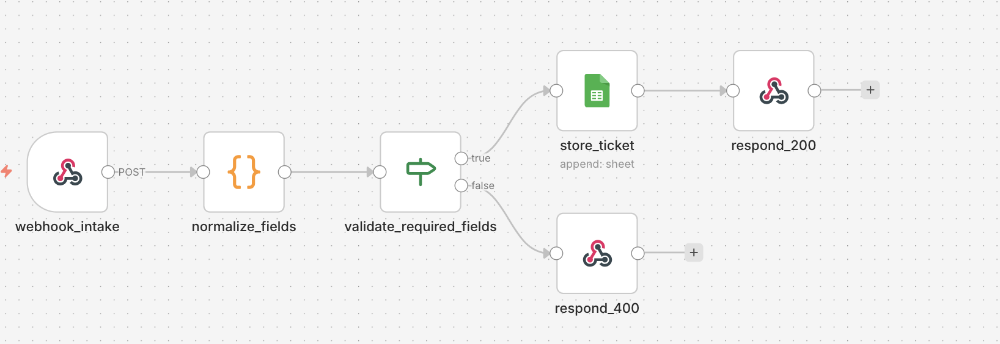
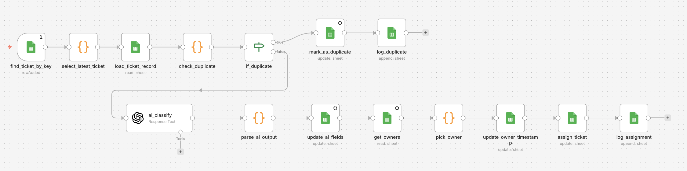

# Sistema de Recepción, Clasificación y Asignación de Tickets con IA

## Descripción
Workflow en n8n para recibir tickets de entrada, estandarizar datos, clasificar solicitudes y derivarlas según su tipo o prioridad.

## Resultados
- Recepción estructurada de tickets de entrada
- Clasificación inicial según reglas definidas
- Estandarización de datos para un procesamiento consistente
- Estructura mantenible y preparada para escalar

## Herramientas utilizadas
- n8n
- Webhooks
- JSON
- Lógica condicional

## Estado
Proyecto de portfolio orientado a demostrar automatización de operaciones y gestión inicial de tickets.

## Capturas del workflow

## Archivos del workflow
- [workflow-export-1.json](./workflow-export-1.json)
- [workflow-export-2.json](./workflow-export-2.json)
