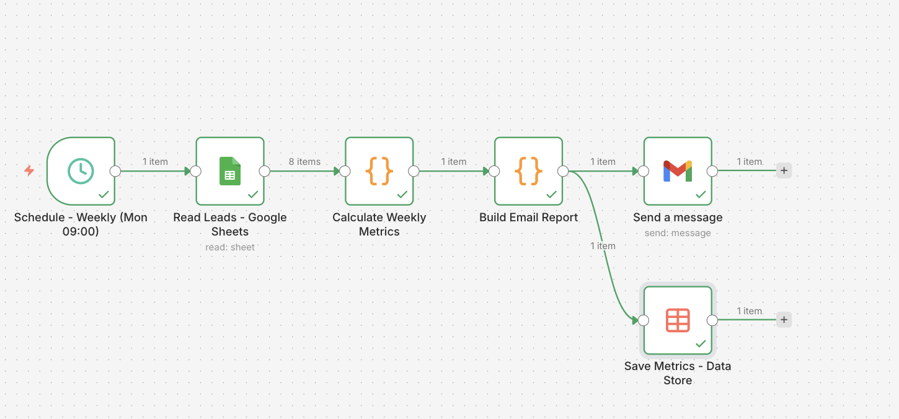

# Sistema de Reporte Semanal de Rendimiento Comercial

## Descripción
Automatización programada en n8n para leer datos operativos, calcular métricas semanales y generar resúmenes estructurados para reporting.

## Resultados
- Ejecución recurrente del workflow en intervalos programados
- Cálculo automático de métricas semanales
- Generación de resúmenes estructurados para seguimiento
- Reducción de la preparación manual de reportes

## Herramientas utilizadas
- n8n
- Google Sheets
- JSON
- Automatización programada

## Estado
Proyecto de portfolio orientado a demostrar reporting automatizado y procesamiento periódico de datos.

## Captura del workflow

## Archivo del workflow
- [workflow-export.json](./workflow-export.json)
