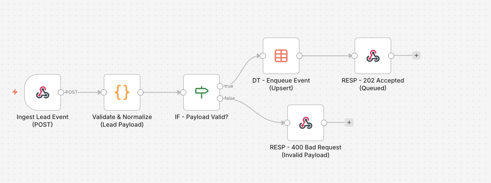
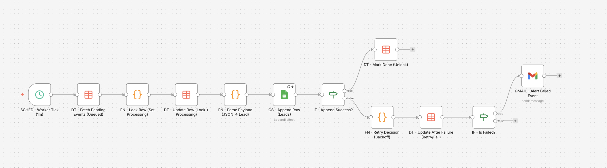

# Webhook Queue Processor & Reliable Event Worker System

Sistema de automatización desarrollado en n8n Cloud que implementa un patrón de ingesta por Webhook + cola + worker para procesar eventos de forma fiable, incluso con picos de tráfico o fallos de APIs externas.

## Objetivo

Diseñar un workflow robusto orientado a entornos reales, separando la recepción del evento de su procesamiento para mejorar la fiabilidad, la trazabilidad y la capacidad de recuperación ante errores.

## Arquitectura

Este proyecto está dividido en 2 workflows independientes:

### Workflow 1 — Ingest API (Webhook → Queue)
Actúa como una API REST en n8n mediante Webhook.

Responsabilidades:
- Recibir eventos de entrada (leads)
- Normalizar y validar el payload
- Generar `idempotency_key`
- Encolar eventos válidos en una Data Table mediante `Upsert`
- Devolver respuestas JSON consistentes al cliente:
  - `202 Accepted` para eventos encolados
  - `400 Bad Request` para payload inválido

### Workflow 2 — Worker (Queue → Google Sheets)
Actúa como un worker programado mediante `Schedule Trigger`.

Responsabilidades:
- Leer eventos pendientes desde la cola
- Aplicar locking para evitar dobles procesamientos
- Parsear el payload almacenado
- Registrar el lead en Google Sheets
- Gestionar reintentos automáticos con backoff en caso de error
- Actualizar estado del evento en la Data Table
- Enviar alerta por Gmail cuando el evento alcanza estado `failed`

## Problema que resuelve

En muchos escenarios reales, no conviene procesar toda la lógica de negocio directamente dentro del Webhook, ya que cualquier caída, lentitud o error externo puede afectar la respuesta de entrada.

Este proyecto resuelve ese problema implementando un patrón fiable de procesamiento asíncrono:

- desacopla la recepción del evento del procesamiento real
- evita duplicados mediante idempotencia
- protege contra dobles ejecuciones mediante locking
- permite reintentos controlados
- mantiene trazabilidad completa del estado del evento
- facilita alertas operativas cuando un procesamiento falla definitivamente

## Flujo del sistema

### 1) Ingesta del evento
El sistema recibe un lead por Webhook `POST`.

### 2) Validación y normalización
Se validan campos obligatorios y se normalizan valores como email, país y source.

### 3) Encolado
Si el payload es válido, el evento se guarda en una Data Table con:
- `status = queued`
- `attempts = 0`
- `max_attempts = 5`
- `idempotency_key`
- `payload`
- timestamps de control

### 4) Respuesta inmediata
El workflow responde inmediatamente al cliente con un JSON consistente, sin esperar al procesamiento final.

### 5) Ejecución del worker
Cada minuto, el worker busca eventos pendientes en la cola.

### 6) Locking y procesamiento
El worker marca el evento como `processing`, bloquea la fila y procesa el payload.

### 7) Escritura en destino
El evento se transforma y se registra en Google Sheets.

### 8) Gestión de errores
Si falla el procesamiento:
- se incrementan intentos
- se calcula `next_retry_at`
- se aplica backoff exponencial
- se actualiza el estado a `queued` o `failed`

### 9) Alerta final
Si se supera el número máximo de intentos, el sistema envía una alerta por Gmail con el detalle del error.

## Buenas prácticas aplicadas

- Separación entre capa de entrada y capa de procesamiento
- Idempotencia para evitar duplicados
- Cola persistente con Data Tables
- Locking para prevenir doble ejecución
- Reintentos con backoff exponencial
- Estados auditables (`queued`, `processing`, `done`, `failed`)
- Alertas operativas por fallo definitivo
- Respuestas API consistentes para integraciones externas

## Herramientas utilizadas

- n8n Cloud
- Webhook
- Respond to Webhook
- Schedule Trigger
- Code
- IF
- Data Tables
- Google Sheets
- Gmail
- JSON

## Caso de uso real

Este patrón puede utilizarse en escenarios como:

- ingesta fiable de leads
- recepción de pedidos o formularios
- procesamiento de eventos desde sistemas externos
- integraciones con APIs que pueden fallar o responder lentamente
- automatizaciones que requieren control de reintentos y auditoría

## Archivos del proyecto

- [workflow-export-1.json](./workflow-export-1.json)
- [workflow-export-2.json](./workflow-export-2.json)

## Capturas

### Workflow 1 — Ingest API

### Workflow 2 — Worker

## Valor para portfolio

Este proyecto demuestra capacidad para diseñar automatizaciones más cercanas a un entorno de producción que a un workflow básico.

Especialmente muestra experiencia en:
- diseño de workflows desacoplados
- procesamiento fiable basado en cola
- control de estado
- recuperación ante errores
- monitorización operativa
- integraciones mantenibles y escalables
