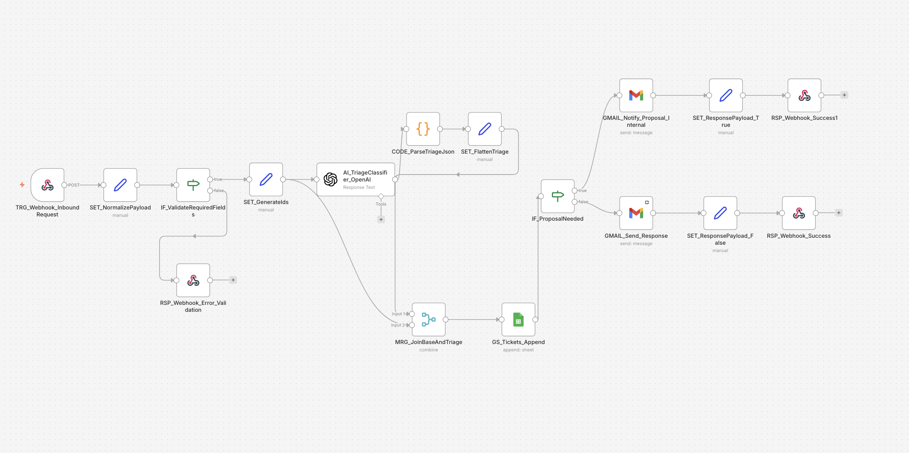

# AI Support Triage & Proposal Detection System

Workflow de automatización desarrollado en n8n Cloud para gestionar tickets de soporte mediante una API basada en Webhook, con clasificación por IA y bifurcación automática según si el caso requiere propuesta o presupuesto.

## Objetivo

Diseñar un workflow orientado a casos reales de soporte que reciba tickets por API, valide y normalice la entrada, aplique clasificación automática con IA y ejecute acciones distintas según el tipo de caso detectado.

## Problema que resuelve

En muchos equipos de soporte, los tickets llegan por distintos canales con formatos inconsistentes y requieren una primera clasificación manual antes de poder actuar.

Este proyecto automatiza esa capa inicial para:

- validar y estandarizar el ticket recibido
- clasificar automáticamente idioma, categoría y prioridad
- detectar si el caso requiere propuesta comercial
- registrar el caso para auditoría y seguimiento
- responder al cliente de forma consistente
- avisar internamente cuando hay oportunidad comercial o solicitud de presupuesto

## Flujo del workflow

### 1) Recepción del ticket
El sistema recibe tickets mediante un Webhook en formato API.

### 2) Validación y normalización
Se validan los campos obligatorios y se normalizan valores del payload para asegurar consistencia.

### 3) Enriquecimiento del ticket
Los tickets válidos se enriquecen con un `ticket_id` y metadatos de control.

### 4) Clasificación con IA
El workflow utiliza IA para clasificar automáticamente:

- idioma
- categoría
- prioridad
- necesidad de intervención humana
- si el ticket requiere propuesta o presupuesto

### 5) Almacenamiento centralizado
El ticket procesado se almacena en Google Sheets para trazabilidad, auditoría y seguimiento operativo.

### 6) Branching por `proposal_needed`
Si el caso requiere propuesta:
- se envía confirmación al cliente
- se envía además una notificación interna con el contexto del ticket

Si no requiere propuesta:
- se envía únicamente la confirmación correspondiente al cliente

### 7) Respuesta API consistente
El workflow finaliza devolviendo una respuesta JSON estructurada al Webhook:
- `200 OK` para tickets válidos procesados
- `400 Bad Request` para payloads inválidos

## Buenas prácticas aplicadas

- Validación de entrada
- Normalización de datos
- Clasificación automática con IA
- Branching basado en reglas de negocio
- Trazabilidad y almacenamiento centralizado
- Notificaciones internas para casos relevantes
- Respuestas API consistentes
- Diseño orientado a integración con sistemas externos

## Herramientas utilizadas

- n8n Cloud
- Webhook
- Respond to Webhook
- Code
- IF
- OpenAI
- Google Sheets
- Gmail
- JSON

## Caso de uso real

Este patrón puede aplicarse en escenarios como:

- mesas de soporte con intake por API
- clasificación automática de tickets entrantes
- detección temprana de oportunidades comerciales
- automatización de soporte con IA
- flujos híbridos entre soporte y ventas

## Archivos del proyecto

- [workflow-export.json](./workflow-export.json)

## Captura

## Valor para portfolio

Este proyecto demuestra capacidad para construir automatizaciones útiles para operaciones reales, combinando intake por API, clasificación con IA, branching de negocio y notificaciones automáticas.

Especialmente muestra experiencia en:

- automatización de procesos de soporte
- clasificación de tickets con IA
- diseño de flujos API-first
- integración entre soporte y propuesta comercial
- trazabilidad operativa y almacenamiento estructurado
