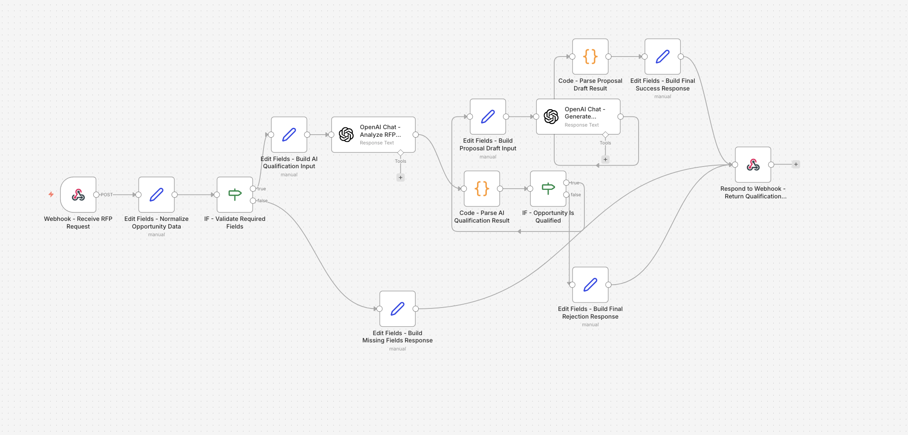

# AI RFP Qualification & Proposal Drafting System

Workflow de automatización desarrollado en n8n Cloud para gestionar solicitudes comerciales B2B tipo RFP de forma estructurada.

## Objetivo

Diseñar una automatización orientada a procesos de pre-sales que reciba oportunidades comerciales por API, valide la información de entrada, analice la solicitud con IA y decida si la oportunidad debe avanzar o no dentro del proceso comercial.

## Problema que resuelve

En muchos entornos B2B, las solicitudes tipo RFP llegan con formatos inconsistentes, información incompleta y requieren una primera revisión manual antes de saber si vale la pena invertir tiempo comercial en ellas.

Este proyecto automatiza esa fase inicial para:

- validar campos obligatorios
- normalizar la entrada
- analizar la oportunidad con IA
- decidir si la solicitud califica o no
- generar un primer borrador de propuesta comercial cuando procede
- devolver respuestas API claras y consistentes

## Flujo del workflow

### 1) Recepción de la oportunidad
El sistema recibe una solicitud comercial por Webhook en formato API.

### 2) Normalización del payload
Se estandarizan los datos de entrada para asegurar consistencia antes del análisis.

### 3) Validación de campos obligatorios
El workflow valida que la solicitud incluya la información mínima necesaria.

### 4) Respuesta de error si faltan datos
Si el payload llega incompleto, el sistema devuelve una respuesta estructurada indicando qué campos faltan.

### 5) Análisis con IA
Si la solicitud es válida, el workflow utiliza IA para evaluar si la oportunidad debe avanzar o no.

### 6) Decisión de cualificación
La automatización aplica lógica condicional según el resultado del análisis:
- si la oportunidad califica, continúa al siguiente paso
- si no califica, devuelve una respuesta de rechazo estructurada

### 7) Generación de borrador comercial
Cuando la oportunidad es válida, el sistema genera automáticamente un primer borrador de propuesta comercial.

### 8) Respuesta API consistente
El workflow finaliza devolviendo una salida estructurada según el caso:
- aceptación con borrador generado
- rechazo de oportunidad no cualificada
- error de validación por datos incompletos

## Buenas prácticas aplicadas

- Validación de entrada
- Normalización de datos
- Clasificación y decisión con IA
- Parsing de salidas de IA
- Lógica condicional clara
- Respuestas API consistentes
- Diseño mantenible orientado a procesos comerciales reales
- Automatización aplicada a pre-sales B2B

## Herramientas utilizadas

- n8n Cloud
- Webhook
- Respond to Webhook
- Code
- IF
- OpenAI
- JSON

## Caso de uso real

Este patrón puede aplicarse en escenarios como:

- recepción automatizada de oportunidades B2B
- cualificación inicial de RFPs
- automatización de procesos de pre-sales
- generación asistida de propuestas comerciales
- filtrado temprano de oportunidades no viables

## Archivos del proyecto

- [workflow-export.json](./workflow-export.json)

## Captura

## Valor para portfolio

Este proyecto demuestra capacidad para construir automatizaciones de negocio orientadas a ventas complejas y procesos de cualificación comercial.

Especialmente muestra experiencia en:

- intake comercial por API
- evaluación automática con IA
- diseño de lógica de cualificación
- generación de borradores comerciales
- integración entre validación, decisión y respuesta estructurada
