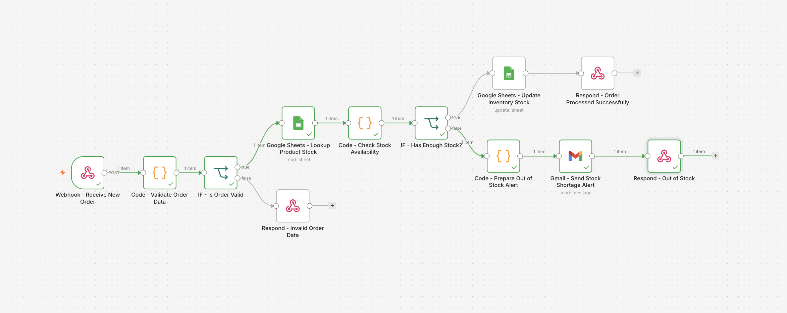
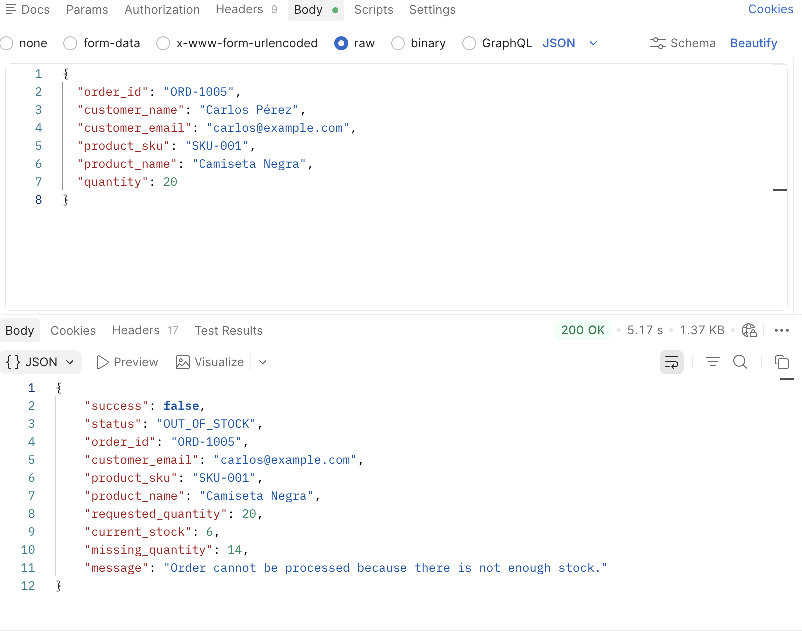
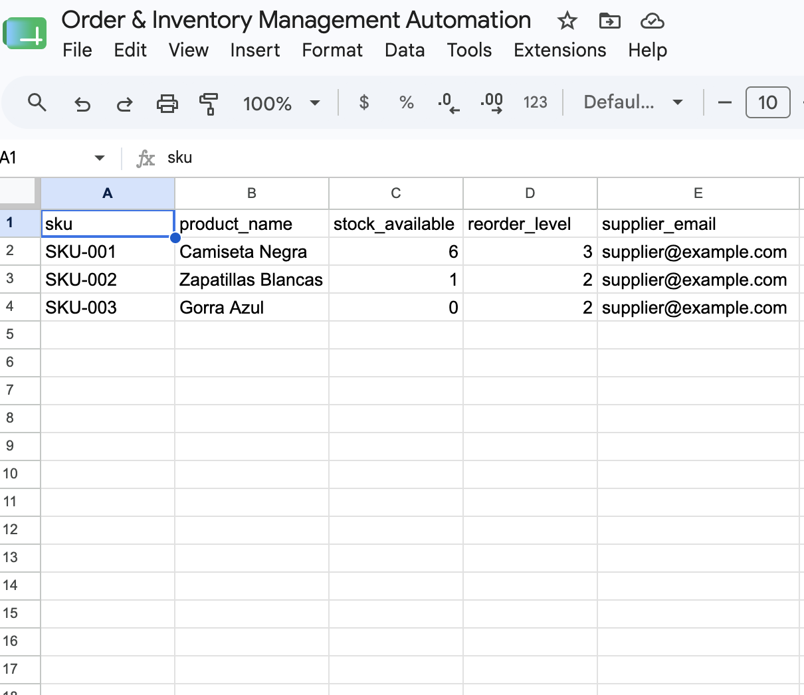
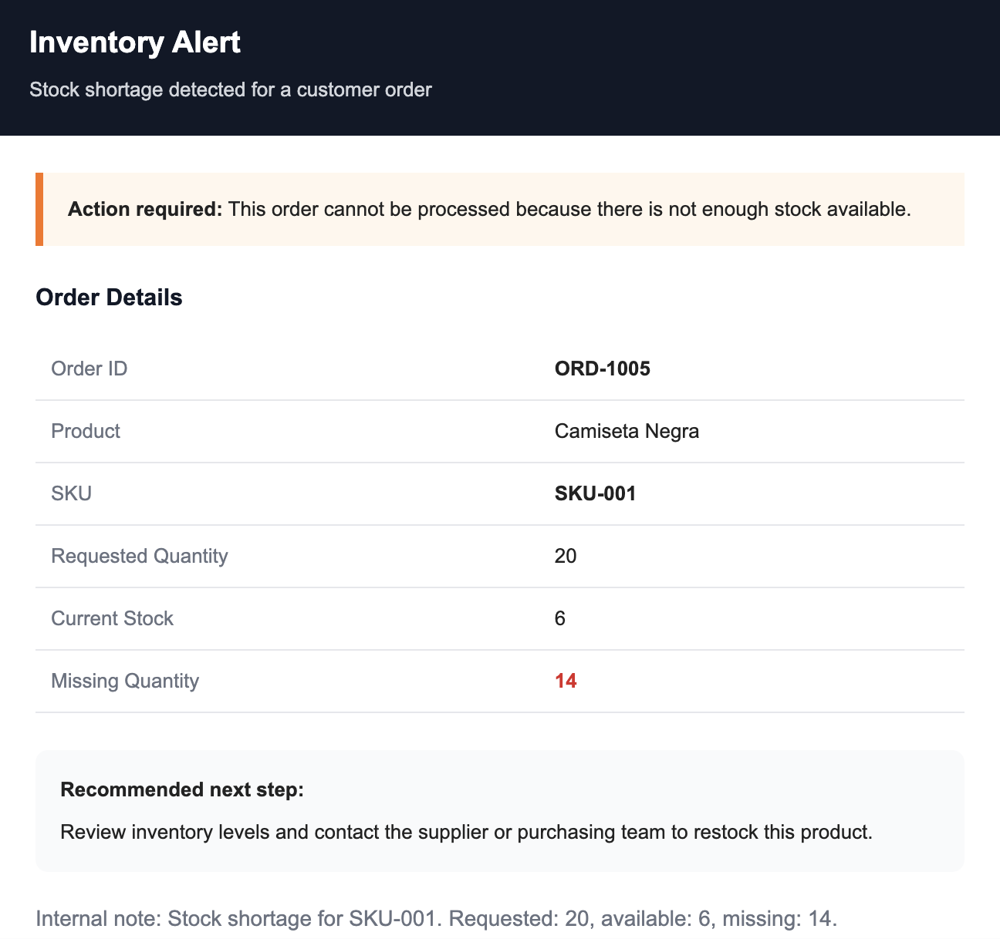

# Ecommerce Operations Automation: Orders & Inventory

Workflow de automatización desarrollado en n8n para gestionar pedidos e inventario en un escenario de e-commerce.

## Objetivo

Automatizar la recepción de pedidos por API, validar la información de entrada, consultar stock disponible, actualizar inventario cuando hay unidades suficientes y generar alertas automáticas cuando no hay stock.

## Problema que resuelve

En operaciones de e-commerce pequeñas y medianas, muchos pedidos requieren validación manual, comprobación de stock y coordinación rápida cuando un producto no tiene disponibilidad suficiente.

Este proyecto automatiza esa lógica para:

- recibir pedidos por Webhook
- validar campos obligatorios
- consultar stock en Google Sheets
- decidir si el pedido puede procesarse o no
- actualizar inventario automáticamente
- enviar alertas por email cuando falta stock
- devolver respuestas JSON claras para cada escenario

## Flujo del workflow

### 1) Recepción del pedido
El sistema recibe un nuevo pedido mediante un Webhook `POST`.

### 2) Validación de datos
Se validan los campos obligatorios del pedido, incluyendo:

- `order_id`
- `customer_name`
- `customer_email`
- `product_sku`
- `quantity`

Si faltan datos o la cantidad no es válida, el workflow responde con error estructurado.

### 3) Consulta de inventario
Se busca el producto en Google Sheets usando el SKU para recuperar:

- nombre del producto
- stock disponible
- nivel de reposición
- email del proveedor

### 4) Comprobación de stock
El workflow calcula si hay stock suficiente para procesar el pedido y determina:

- stock actual
- cantidad solicitada
- nuevo stock
- si el pedido puede procesarse
- si hay riesgo de rotura o falta de inventario

### 5) Rama de pedido válido con stock suficiente
Si hay stock disponible:

- se actualiza el inventario en Google Sheets
- se devuelve una respuesta JSON de éxito
- el pedido queda marcado como procesado correctamente

### 6) Rama de pedido sin stock suficiente
Si no hay stock disponible:

- se prepara una alerta interna
- se envía un email de aviso por Gmail
- se devuelve una respuesta JSON indicando falta de stock

### 7) Rama de pedido inválido
Si el pedido no cumple validación:

- no se consulta inventario
- no se actualiza stock
- se devuelve una respuesta JSON con detalle del error y campos faltantes

## Buenas prácticas aplicadas

- Validación de entrada
- Branching por reglas de negocio
- Respuestas API consistentes
- Integración con Google Sheets como inventario operativo
- Automatización de alertas internas
- Separación clara entre validación, lógica de stock y respuesta final
- Diseño útil para testing con Postman

## Herramientas utilizadas

- n8n
- Webhook
- Respond to Webhook
- Code
- IF
- Google Sheets
- Gmail
- JavaScript
- Postman

## Casos de respuesta cubiertos

### Pedido procesado correctamente
Cuando el producto tiene stock suficiente:
- el inventario se actualiza
- la API devuelve confirmación de procesamiento

### Pedido sin stock
Cuando la cantidad solicitada supera el stock disponible:
- se envía alerta interna
- la API devuelve respuesta `OUT_OF_STOCK`

### Pedido inválido
Cuando faltan datos o la cantidad no es válida:
- la API devuelve respuesta `INVALID_ORDER_DATA`

## Archivos del proyecto

- [workflow-export.json](./workflow-export.json)

## Captura principal

## Evidencias adicionales

## Valor para portfolio

Este proyecto demuestra capacidad para diseñar automatizaciones útiles para operaciones reales de e-commerce, especialmente en procesos donde inventario, validación y respuesta rápida son críticos.

Especialmente muestra experiencia en:

- automatización de pedidos
- control de stock
- integración con Google Sheets
- lógica condicional con JavaScript
- respuestas API estructuradas
- alertas operativas por email
