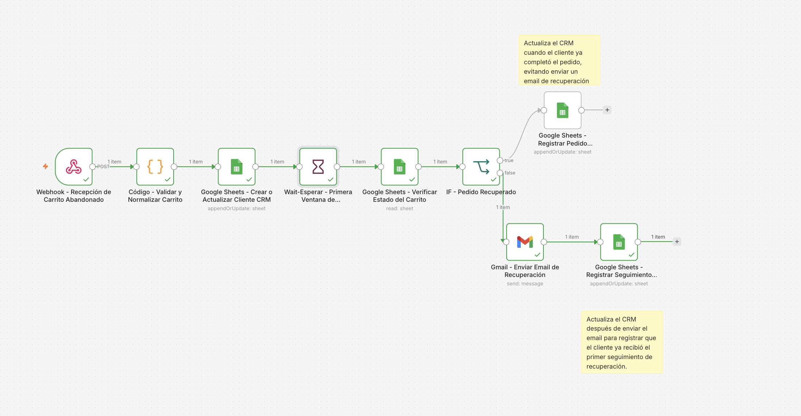
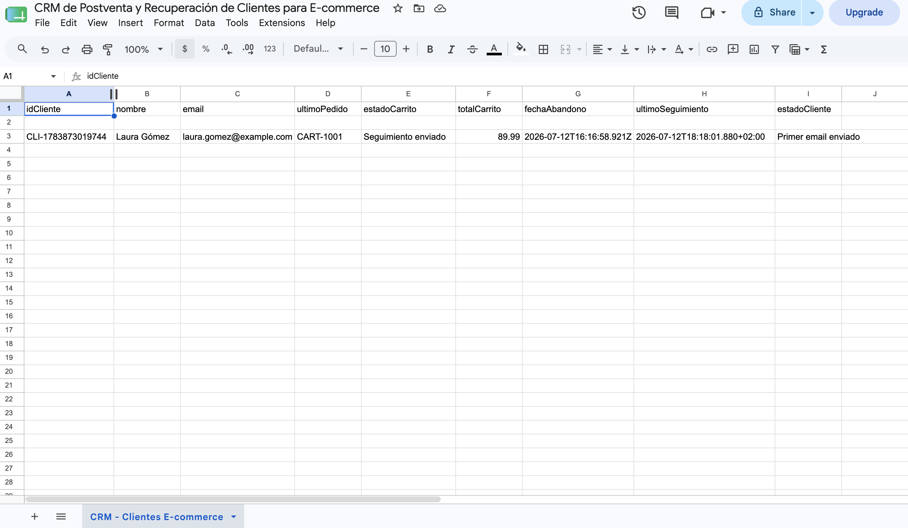

# CRM de Postventa y Recuperación de Carritos Abandonados para E-commerce

He desarrollado un workflow en n8n para automatizar procesos de CRM y postventa en e-commerce, enfocado en la recuperación de carritos abandonados.

El sistema recibe carritos abandonados mediante webhook, valida y normaliza los datos del cliente, registra o actualiza la información en Google Sheets como CRM, espera una ventana de recuperación, verifica si el pedido ya fue completado y decide automáticamente si debe enviar un email personalizado o registrar el pedido como recuperado.

La automatización incluye lógica condicional, espera inteligente, actualización de CRM, envío de emails HTML personalizados y control para evitar comunicaciones innecesarias a clientes que ya han completado su compra.

## Objetivo

Automatizar la gestión inicial de recuperación de carritos abandonados y el seguimiento postventa en e-commerce, reduciendo trabajo manual y mejorando la trazabilidad del cliente.

## Problema que resuelve

En operaciones de e-commerce, el abandono de carrito suele requerir revisión manual, actualización del CRM y envío de emails de seguimiento. Esto genera retrasos, inconsistencias y pérdida de oportunidades de recuperación.

Este proyecto automatiza ese flujo para:

- recibir eventos de carrito abandonado por webhook
- validar y normalizar datos del cliente
- registrar o actualizar información en un CRM basado en Google Sheets
- esperar una primera ventana de recuperación
- comprobar si el cliente ya completó el pedido
- enviar email solo cuando sigue siendo necesario
- actualizar el CRM según el resultado del flujo

## Flujo del workflow

### 1) Recepción del carrito abandonado
El workflow recibe la información mediante un Webhook `POST`.

### 2) Validación y normalización
Se limpian y estandarizan campos como nombre del cliente, email, pedido, total y fecha de abandono.

### 3) Registro o actualización en CRM
Se guarda o actualiza el cliente en Google Sheets para mantener trazabilidad del estado del carrito.

### 4) Espera inteligente
El workflow utiliza un nodo `Wait` para abrir una primera ventana de recuperación sin enviar el email inmediatamente.

### 5) Verificación del estado del carrito
Tras la espera, consulta el CRM para validar si el cliente ya completó el pedido.

### 6) Rama de pedido recuperado
Si el cliente ya compró:

- no se envía email
- se actualiza el CRM como pedido recuperado
- se evita una comunicación innecesaria

### 7) Rama de carrito no recuperado
Si el pedido sigue abandonado:

- se envía un email HTML personalizado
- se registra en el CRM que se ha realizado el primer seguimiento
- se actualiza el estado del cliente

## Buenas prácticas aplicadas

- Validación de entrada
- Normalización de datos
- CRM simple pero trazable en Google Sheets
- Espera inteligente para evitar envíos inmediatos
- Branching según estado real del carrito
- Prevención de comunicaciones innecesarias
- Email HTML personalizado
- Caso de uso realista de automatización CRM/postventa

## Herramientas utilizadas

- n8n
- Webhooks
- Google Sheets
- Gmail
- JavaScript
- Wait node
- Postman

## Archivos del proyecto

- [workflow-export.json](./workflow-export.json)

## Captura principal

## Evidencia adicional

## Valor para portfolio

Este proyecto demuestra capacidad para construir automatizaciones útiles para marketing automation, CRM y postventa en e-commerce.

Especialmente muestra experiencia en:

- recuperación de carritos abandonados
- automatización CRM
- espera inteligente con lógica temporal
- integración con Google Sheets
- envío de emails personalizados
- trazabilidad de clientes y seguimiento comercial
